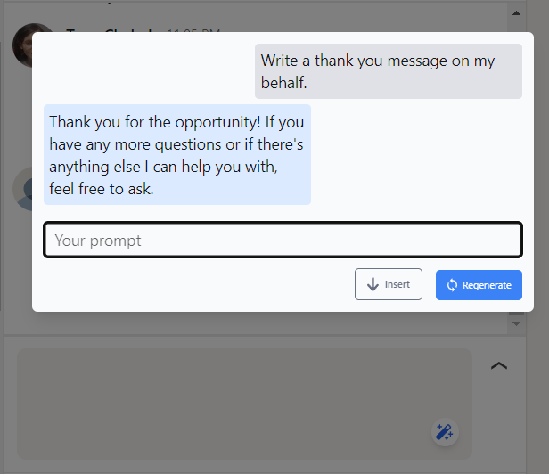

# LinkedIn AI Reply

A simple chrome extension made using WXT, React, Typescript & TailwindCSS.

# Demo

[Watch Demo](https://vimeo.com/1013950990) or https://vimeo.com/1013950990



# Local Setup Guide

## 1. Clone the Repository
First, clone the repository using the following command:

```bash
git clone <repo-url> .
# or
git clone <repo-url> <folder-to-clone-repo-in>
```

## 2. Install Dependencies
Navigate into the project directory and install all necessary packages and dependencies by running:

```bash
npm install
```

## 3. Run in Development Mode
Once all the dependencies are installed, you can start the extension in development mode using:

```bash
npm run dev
```
This will launch the extension in a new Chrome tab, and you can start making changes to the codebase.

## 4. Start Developing
- `./entrypoints/popup` contains popup elements of extension.
 - `./entrypoints/content.ts` contains the starting point of the code.
 - `./src` contains the components related to extension's functionality.
 - To view extension's functionality you need to go to visit LinkedIn's (https://www.linkedin.com) messaging page.